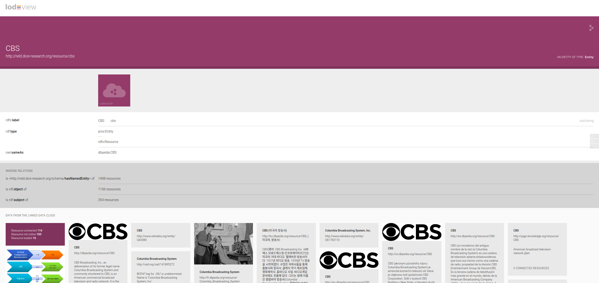

========
Tutorial
========

On this and next few pages, we will introduce the basics implemenation usage and example of **RELD** knowledge Graph.

Framework
=========

The diagram shows the basic **RELD** Framework. This diagram explains the basic schema of the **RELD**.
The edges represent the relations between different classes, while the rectangles represent classes in our schema.
The complete explanation of vocabularies and ontologies is available in other sections. 
For the TTL version of schema, click on the `link <https://github.com/dice-group/RELD/blob/main/ontology.ttl>`_

.. image:: /images/mod.png

Mapping to RELD
===============

The following diagram shows an overview of all the steps requires to convert a relation
extraction dataset to RDF and integrate it into an RDF-based RELD knowledge graph. The input is a relation extraction dataset available in different
formats such as XML, txt, or JSON. Then a python script using `RDFLib
<https://github.com/RDFLib/rdflib>`_ and other python libraries converts the
dataset to RDF form. Furthermore, we use `sameAs <http://sameas.org/>`_ and
`DBpedia spotlight https://www.dbpedia-spotlight.org/docs/spotlight.pdf`_ to link entities with other large knowledge bases such
as `DBpedia <https://www.dbpedia.org/>`_ and `Wikidata <https://www.wikidata.org/wiki/Wikidata:Main_Page>`_ . In addition, we use tools like `Spacy <https://spacy.io/>`_ and
`NLTK <https://www.nltk.org/>`_  to add missing annotations. Finally combines all the previous steps
using RELD schema and makes it available publicly using a dereferenceable
knowledge graph using `LodView <https://lodview.it/>`_.

.. image:: /images/map.svg

Used Namespaces
===============
Some of the namespaces we used in **RELD**:

.. code-block:: ttl

   @prefix reldr: <http://reld.dice-research.org/resource/>
   @prefix reldp: <http://reld.dice-research.org/property/>
   @prefix dbo: <http://dbpedia.org/ontology/>
   @prefix dc: <http://purl.org/dc/elements/1.1/>
   @prefix freebase: <http://rdf.freebase.com/ns>
   @prefix owl: <http://www.w3.org/2002/07/owl#>
   @prefix ps: <http://www.wikidata.org/prop/statement/>
   @prefix rdf: <http://www.w3.org/1999/02/22-rdf-syntax-ns#>
   @prefix rdfs: <http://www.w3.org/2000/01/rdf-schema#>
   @prefix xml: <http://www.w3.org/XML/1998/namespace>
   @prefix xsd: <http://www.w3.org/2001/XMLSchema#>
   @prefix prov: <http://www.w3.org/ns/prov#>
   @prefix schema: <http://schema.org/>
   @prefix dicom: <http://purl.org/healthcarevocab/v1>
   @prefix dcterms: <http://purl.org/dc/terms/>
   @prefix nif: <http://persistence.uni-leipzig.org/nlp2rdf/ontologies/nif-core#>
   @prefix foaf: <http://xmlns.com/foaf/0.1/>
   @prefix void: <http://rdfs.org/ns/void#>
   @prefix bibtex: <http://purl.org/net/nknouf/ns/bibtex#>
   @prefix dcat: <http://www.w3.org/ns/dcat>
   @prefix prof: <http://www.w3.org/ns/dx/prof/hasToken>

Example Resource
================
Following is an example resource:

.. code-block:: ttl

   @prefix nif: <http://persistence.uni-leipzig.org/nlp2rdf/ontologies/nif-core#>
   @prefix ns1: <http://www.w3.org/ns/dx/prof/> 
   @prefix ns2: <http://purl.org/net/nknouf/ns/bibtex#>
   @prefix ns3: <http://www.w3.org/ns/>
   @prefix owl: <http://www.w3.org/2002/07/owl#>
   @prefix prov: <http://www.w3.org/ns/prov#>
   @prefix rdf: <http://www.w3.org/1999/02/22-rdf-syntax-ns#>
   @prefix rdfs: <http://www.w3.org/2000/01/rdf-schema#>
   @prefix reld: <http://reld.dice-research.org/schema/>
   @prefix reldr: <http://reld.dice-research.org/resource/>
   @prefix reldp: <http://reld.dice-research.org/property/>
   @prefix xsd: <http://www.w3.org/2001/XMLSchema#>

   # STRING INSTANCE
   reldr:S-1375181 a nif:String ;
      ns2:hasTitle "Sonic Extreme"^^xsd:string ;
      reldr:hasPOS reldr:posSeq1375181 ;
      reldr:hasPunctuation reldr:puncSeq1375181 ;
      reld:hasNamedEntity reldr:sonic,
      reldr:sonic_extreme ;
      reld:hasStatement reldr:Stmt13751810 ;
      reld:numSent "2"^^xsd:int ;
      reld:strType "document"^^xsd:string ;
      ns3:dcatdistribution "train"^^xsd:string ;
      ns1:hasToken reldr:token_1375181 ;
      prov:hadPrimarySource reldr:ds_08 .

   # PARTS OF SPEACH POS INSTANCE
   reldr:posSeq1375181 a reld:POS ;
      rdf:_0 "JJ"^^xsd:string ;
      rdf:_1 "NNP"^^xsd:string ;
      rdf:_10 "NNP"^^xsd:string ;
      rdf:_11 "DT"^^xsd:string ;
      rdf:_12 "NNP"^^xsd:string ;
      rdf:_13 "NN"^^xsd:string ;
      rdf:_14 "IN"^^xsd:string ;
      rdf:_15 "DT"^^xsd:string ;
      rdf:_16 "NNP"^^xsd:string ;
      rdf:_17 "."^^xsd:string ;
      rdf:_18 "IN"^^xsd:string ;
      rdf:_19 "DT"^^xsd:string ;
      rdf:_2 "VBZ"^^xsd:string ;
      rdf:_20 "NN"^^xsd:string ;
      rdf:_21 "VBD"^^xsd:string ;
      rdf:_22 "RB"^^xsd:string ;
      rdf:_23 "RB"^^xsd:string ;
      rdf:_24 "VBN"^^xsd:string ;
      rdf:_25 ","^^xsd:string ;
      rdf:_26 "NN"^^xsd:string ;
      rdf:_27 "IN"^^xsd:string ;
      rdf:_28 "DT"^^xsd:string ;
      rdf:_29 "NN"^^xsd:string ;
      rdf:_3 "DT"^^xsd:string ;
      rdf:_30 "VBD"^^xsd:string ;
      rdf:_31 "VBN"^^xsd:string ;
      rdf:_32 "RB"^^xsd:string ;
      rdf:_33 "RB"^^xsd:string ;
      rdf:_34 "IN"^^xsd:string ;
      rdf:_35 "DT"^^xsd:string ;
      rdf:_36 "NN"^^xsd:string ;
      rdf:_37 "NN"^^xsd:string ;
      rdf:_38 "NN"^^xsd:string ;
      rdf:_39 "."^^xsd:string ;
      rdf:_4 "JJ"^^xsd:string ;
      rdf:_5 "NN"^^xsd:string ;
      rdf:_6 "NN"^^xsd:string ;
      rdf:_7 "NN"^^xsd:string ;
      rdf:_8 "IN"^^xsd:string ;
      rdf:_9 "DT"^^xsd:string .

   # TOKEN INSTANCE
   reldr:token_1375181 a reld:Token ;
      rdf:_0 "Sonic"^^xsd:token ;
      rdf:_1 "Extreme"^^xsd:token ;
      rdf:_10 "Sonic"^^xsd:token ;
      rdf:_11 "the"^^xsd:token ;
      rdf:_12 "Hedgehog"^^xsd:token ;
      rdf:_13 "series"^^xsd:token ;
      rdf:_14 "for"^^xsd:token ;
      rdf:_15 "the"^^xsd:token ;
      rdf:_16 "Xbox"^^xsd:token ;
      rdf:_17 "."^^xsd:token ;
      rdf:_18 "While"^^xsd:token ;
      rdf:_19 "the"^^xsd:token ;
      rdf:_2 "is"^^xsd:token ;
      rdf:_20 "game"^^xsd:token ;
      rdf:_21 "was"^^xsd:token ;
      rdf:_22 "never"^^xsd:token ;
      rdf:_23 "officially"^^xsd:token ;
      rdf:_24 "released"^^xsd:token ;
      rdf:_25 ","^^xsd:token ;
      rdf:_26 "footage"^^xsd:token ;
      rdf:_27 "of"^^xsd:token ;
      rdf:_28 "the"^^xsd:token ;
      rdf:_29 "game"^^xsd:token ;
      rdf:_3 "a"^^xsd:token ;
      rdf:_30 "was"^^xsd:token ;
      rdf:_31 "received"^^xsd:token ;
      rdf:_32 "very"^^xsd:token ;
      rdf:_33 "poorly"^^xsd:token ;
      rdf:_34 "by"^^xsd:token ;
      rdf:_35 "the"^^xsd:token ;
      rdf:_36 "video"^^xsd:token ;
      rdf:_37 "game"^^xsd:token ;
      rdf:_38 "press"^^xsd:token ;
      rdf:_39 "."^^xsd:token ;
      rdf:_4 "cancelled"^^xsd:token ;
      rdf:_5 "skateboarding"^^xsd:token ;
      rdf:_6 "video"^^xsd:token ;
      rdf:_7 "game"^^xsd:token ;
      rdf:_8 "in"^^xsd:token ;
      rdf:_9 "the"^^xsd:token .

   # PUNCTUATION INSTANCE
   reldr:puncSeq1375181 a reld:Punctuation ;
      rdf:_0 "."^^xsd:string ;
      rdf:_1 ","^^xsd:string
      rdf:_2 "."^^xsd:string .

   # STATEMENT INSTANCE
   reldr:Stmt13751810 a rdf:Statement ;
      reld:objEndIndex 7 ;
      reld:objStartIndex 6 ;
      reld:subEndIndex 1 ;
      reld:subFollowObj false ;
      reld:subStartIndex 0 ;
      rdf:object reldr:video_game ;
      rdf:predicate reldp:P31 ;
      rdf:subject reldr:sonic_extreme .

   # SUBJECT/ENTITY INSTANCE
   reldr:sonic_extreme a rdfs:Resource,
      prov:Entity ;
      rdfs:label "Sonic_Extreme"^^xsd:string,
      "sonic_extreme"^^xsd:string .

   # OBJECT INSTANCE
   reldr:brave_video_game a rdfs:Resource ;
      rdfs:label "Brave_video_game"^^xsd:string .

   # PREDICATE INSTANCE
   reldp:P31 a rdf:Property ;
      rdfs:label "P31"^^xsd:string ;
      owl:equivalentProperty reldp:instance_of .

   # DATASET INSTANCE
   reldr:ds_08 a reld:Dataset ;
      dbo:knownFor "relation_extraction_and_natural_language"^^xsd:string ;
      dc:title "T-REx"^^xsd:string ;
      dcterms:language "en"^^xsd:string ;
      dicom:datasetType "document"^^xsd:string ;
      schema:url <https://hadyelsahar.github.io/t-rex/downloads> .

Some useful queires
==================

.. code-block:: sparql

   # Get all Relations from NYT-FB dataset.

   SELECT DISTINCT ?relation
   FROM <http://reld.dice-research.org/Nyt-FB>
   WHERE {
      ?s a rdf:Statement;
         rdf:predicate ?relation.
   }

.. code-block:: sparql

   #Get all triples from Wikipedia-Wikidata

   SELECT DISTINCT count(*)
   FROM <http://reld.dice-research.org/WikiRE>
   WHERE {
      ?s ?p ?o . 
   }

.. code-block:: sparql

   # Get all distinct String instances which have number of tokens higher than 250

   PREFIX reld: <http://reld.dice-research.org/schema/>
   PREFIX nif: <http://persistence.uni-leipzig.org/nlp2rdf/ontologies/nif-core#>
   PREFIX prof: <http://www.w3.org/ns/dx/prof/>
   SELECT DISTINCT ?sent
   WHERE {
      ?sent a nif:String;
            prof:hasToken ?token.
      
      ?token ?p ?o.
   }
   GROUP BY ?sent
   HAVING (COUNT (?token ) > 250)

.. code-block:: sparql

   # Select all sentences containing more than 50 named entities

   PREFIX reld: <http://reld.dice-research.org/schema/>
   PREFIX nif: <http://persistence.uni-leipzig.org/nlp2rdf/ontologies/nif-core#>
   PREFIX prof: <http://www.w3.org/ns/dx/prof/>
   PREFIX prov: <http://www.w3.org/ns/prov#>
   SELECT DISTINCT ?sent
   WHERE {
   ?sent a nif:String;
      reld:hasNamedEntity ?ent.
   }
   GROUP BY ?sent
   HAVING (COUNT (?ent) > 50)

.. code-block:: sparql

   # Select all distinct relations with averges of subject and object start indices

   PREFIX reldv: <http://reld.dice-research.org/schema/>
   PREFIX nif: <http://persistence.uni-leipzig.org/nlp2rdf/ontologies/nif-core#>
   PREFIX prof: <http://www.w3.org/ns/dx/prof/>
   PREFIX prov: <http://www.w3.org/ns/prov#>

   SELECT DISTINCT ?r (AVG(?subIndex) as ?avgSubStrtIdx) (AVG(?objIndex) as ?avgObjStrtIdx)
   WHERE {
      ?stmt a rdf:Statement;
      rdf:predicate ?r;
      reldv:subStartIndex ?subIndex;
      reldv:objStartIndex ?objIndex.
   
   }  

.. code-block:: sparql

   # Generate benchmark of having sentences length less than 50, and other required features

   PREFIX reld:<http://reld.dice-research.org/schema/>
   PREFIX nif:<http://persistence.uni-leipzig.org/nlp2rdf/ontologies/nif-core#>
   PREFIX prof:<http://www.w3.org/ns/dx/prof/>
   SELECT DISTINCT
   ?sent ( count(?t ) as ?Tokens) ( count (?e) as ?Entities) ( count(?stmt) as ?Statment)
   WHERE
   {
      ?sent a nif:String ;
      reld:hasStatement ?stmt ;
      reld:hasNamedEntity ?e ;
      prof:hasToken ?token .
      ?token ?p ?t .
   }
   GROUP BY ?sent
   HAVING ( COUNT(?stmt) > 4 && COUNT (?e) > 10 && COUNT(?t ) < 50)

.. code-block:: sparql

   # A balance dataset of relations each having 700 sentneces
   
   PREFIX reld:<http://reld.dice-research.org/schema/>
   PREFIX nif:<http://persistence.uni-leipzig.org/nlp2rdf/ontologies/nif-core#>
   PREFIX prof:<http://www.w3.org/ns/dx/prof/>
   SELECT DISTINCT ?properties COUNT(?sent )
   WHERE {
      ?sent a nif:String ;
      reld:hasStatement ?stmt .
      ?stmt rdf:predicate ?properties .
   }
   GROUP BY ?properties
   HAVING ( COUNT(?sent ) = 700)

Dereferencing 
=============

We also allow dereferencing our dataset URIs using the LodView link. LodView allows RELD users to browse our RDF resource
and offers an easy-to-use representation of the RDF data. An example resource from LodView is shown in the following figure.
To see it online, click `here <https://reld.dice-research.org/lodview/cbs.html>`_

Usage
======

Named Graphs
------------

To use the data of a single relation extraction dataset **RELD** uses a named graph. Named graphs in **RELD** are kept using
the http://reld.dice-research.org/``dataset_name``. ``dataset_name`` in URI represents the name of each dataset. For simplicity, we use the names
of the datasets as shown in the following :ref:`Table <table>` . Few datasets names are shorten for simplicity.

.. _table:

.. csv-table:: Named Graphs with their used URIs in RELD
   :header: Dataset, Named Graphs 
   :widths: 15,30

   SemEval 2010 Task 8, http://reld.dice-research.org/SemEval
   NYT-FB, http://reld.dice-research.org/Nyt-FB
   FewREL, http://reld.dice-research.org/FewRel
   Google-RE, http://reld.dice-research.org/Google-RE
   WebNLG, http://reld.dice-research.org/WebNLG
   Wikipedia-Wikidata,http://reld.dice-research.org/WikiRE
   DocRED,http://reld.dice-research.org/DocRed
   T-REx,http://reld.dice-research.org/T-Rex 

nif:String
----------

Sentences/Documents are represented in the String IRI format as http://reld.dice-research.org/resource`S_ID`. 
ID  in `S_ID` is the unique value for each string or document. All the properties of the sentences/documents are attached to the sentences.
The detail of each property is available in our schema.

rdf:Statement
-------------

Each string has a corresponding single or multiple annotated statements. This RDF statement also has a unique IRI like the `nif:String`.
Each statement has an attached Subject and the object also has an attached predicate which represents the corresponding relation.

Relation
--------

Relations are attached with statements as `rdf:predicate`. The IRI is different than other resources to uniquely differentiate predicate from 
other resources. Instead of resource we use `property` for relations http://reld.dice-research.org/property/`property_name`. 

RELD Prefered Namespaces
------------------------

We use three different namespaces for RELD. 

* reld: for schema of reld such as classes and properties
* reldr: for resources such as instances 
* reldp: for properties/predicates 

.. csv-table:: Namespaces with IRIs
   :header: Namespaces, IRI
   :widths: 10, 30

   reld, http://reld.dice-research.org/schema/
   rledr,http://reld.dice-research.org/resource/
   reldp,http://reld.dice-research.org/property/

RELD Metadata in Void
=====================

We represents metadata of **RELD** in void representation. 

.. code-block:: ttl

   @prefix rdf: <http://www.w3.org/1999/02/22-rdf-syntax-ns#> .
   @prefix rdfs: <http://www.w3.org/2000/01/rdf-schema#> .
   @prefix foaf: <http://xmlns.com/foaf/0.1/> .
   @prefix dcterms: <http://purl.org/dc/terms/> .
   @prefix void: <http://rdfs.org/ns/void#> .
   @prefix xsd: <http://www.w3.org/2001/XMLSchema#> .
   @prefix owl: <http://www.w3.org/2002/07/owl#> .
   @prefix reldr: <https://reld.dice-research.org/resource/> .
   @prefix : <#> .

   :RELD
      rdf:type void:Dataset ;
      foaf:homepage <https://reld-tutorial.readthedocs.io/en/latest/intro.html> ;
      dcterms:title "Knowledge Graph of Relation Extraction" ;
      void:sparqlEndpoint <http://reld.cs.upb.de:8890/sparql>;
      dcterms:contributor <https://dice-research.org> ;
      dcterms:source <https://github.com/dice-group/RELD> ;
      dcterms:modified "2022-11-03"^^xsd:date ;
      dcterms:publisher :Manzoor_Ali ;
      dcterms:publisher :Muhammad_Saleem ; 					  
      dcterms:publisher :Diego_Moussallem ;
      dcterms:publisher :Mohamed_Ahmed_Sherif ;
      dcterms:publisher :Axel-Cyrille_Ngonga_Ngomo ;
      dcterms:license <https://creativecommons.org/licenses/by-nc/3.0/> ;
      void:feature <https://www.w3.org/ns/formats/data/Turtle> ;
      void:fearure <https://www.w3.org/ns/formats/data/JSON-LD>;
      void:triples 55305748 ;
      void:vocabulary <http://reld.dice-research.org/resource/> ;
      void:vocabulary <http://reld.dice-research.org/schema/> ;
      void:vocabulary <http://purl.org/ontology/bibo/> ;
      void:vocabulary <http://purl.org/net/nknouf/ns/bibtex#> ;
      void:vocabulary <http://purl.org/dc/terms/> ;
      void:vocabulary <http://xmlns.com/foaf/0.1/> ;
      void:vocabulary <http://www.w3.org/2005/11/its/rdf#> ;
      void:vocabulary <http://www.w3.org/ns/prov#> ;
      void:vocabulary <http://www.w3.org/1999/02/22-rdf-syntax-ns#> ;
      void:vocabulary <http://www.w3.org/2000/01/rdf-schema#> ;
      void:vocabulary <http://schema.org/> ;
      void:vocabulary <http://www.w3.org/2006/vcard/ns#> ;
      void:vocabulary <http://www.w3.org/XML/1998/namespace> ;
      void:vocabulary <http://www.w3.org/2001/XMLSchema#> ;
      void:vocabulary <https://data.linkeddatafragments.org/> ;
      void:linkPredicate rdfs:seeAlso ;
      void:linkPredicate rdfs:label ;
      void:linkPredicate rdf:type ;
      void:linkPredicate owl:equivalenProperty ;
      void:linkPredicate owl:sameAs .

   reldr:Google_RE a void:Dataset; 
      void:target <https://reld.dice-research.org/>; 
      void:target <https://github.com/google-research-datasets/>; 
      void:linkPredicate owl:sameAs; 
      void:triples 685633 . 

   reldr:NYT-FB a void:Dataset; 
      void:target <https://reld.dice-research.org/>; 
      void:target <http://iesl.cs.umass.edu/riedel/ecml/>; 
      void:linkPredicate owl:sameAs; 
      void:triples 3119910 . 
   reldr:FewRel a void:Dataset; 
      void:target <https://reld.dice-research.org/>; 
      void:target <https://www.zhuhao.me/fewrel/>; 
      void:linkPredicate owl:sameAs; 
      void:triples 1288803 .
   reldr:SemEval a void:Dataset; 
      void:target <https://reld.dice-research.org/>; 
      void:target <http://www.kozareva.com/>; 
      void:linkPredicate owl:sameAs; 
      void:triples 188991 .

   reldr:WebNLG a void:Dataset; 
      void:target <https://reld.dice-research.org/>; 
      void:target <https://webnlg-challenge.loria.fr/>; 
      void:linkPredicate owl:sameAs; 
      void:triples 1863267 . 

   reldr:Wiki-RE a void:Dataset; 
      void:target <https://reld.dice-research.org/>; 
      void:target <https://www.informatik.tu-darmstadt.de/ukp/research_ukp/ukp_research_data_and_software/>; 
      void:linkPredicate owl:sameAs; 
      void:triples 41156660 . 

   reldr:docRed a void:Dataset; 
      void:target <https://reld.dice-research.org/>; 
      void:target <https://github.com/thunlp/DocRED>; 
      void:linkPredicate owl:sameAs; 
      void:triples 2487493 . 
   reldr:t-rex a void:Dataset; 
      void:target <https://reld.dice-research.org/>; 
      void:target <https://hadyelsahar.github.io/t-rex/downloads/>; 
      void:linkPredicate owl:sameAs.
         
   :Manzoor_Ali a 
      foaf:Person ;
      rdfs:label "Manzoor Ali" ;
      foaf:homepage <https://dice-research.org/ManzoorAli>; 
      foaf:mbox <mailto:manzoor@mail.uni-paderborn.de> .

   :Muhammad_Saleem a 
      foaf:Person ;
      rdfs:label "Muhammad Saleem" ;
      foaf:homepage <https://dice-research.org/MuhammadSaleem>; 
      foaf:mbox <mailto:saleem@informatik.uni-leipzig.de> .

   :Diego_Moussallem a 
      foaf:Person ;
      rdfs:label "Diego Moussallem" ;
      foaf:homepage <https://dice-research.org/DiegoMoussallem>; 
      foaf:mbox <mailto:diego.moussallem@uni-paderborn.de> .

   :Mohamed_Ahmed_Sherif a 
      foaf:Person ;
      rdfs:label "Mohamed Ahmed Sherif" ;
      foaf:homepage <https://dice-research.org/MohamedAhmedSherif>; 
      foaf:mbox <mailto:mohamed.sherif@upb.de> .

   :Axel-Cyrille_Ngonga_Ngomo a 
      foaf:Person ;
      rdfs:label "Axel-Cyrille Ngonga Ngomo" ;
      foaf:homepage <https://dice-research.org/AxelCyrilleNgongaNgomo>; 
      foaf:mbox <mailto:axel.ngonga@upb.de> .
